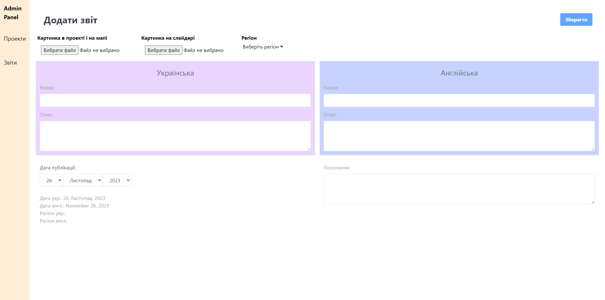

# Sky of Ukraine Backend
This backend server is built with Express.js, MySQL, and TypeORM to support the project and report management website. The server includes migrations and seeds for easy database setup.

Visit this website: 
 [https://skyua.org](https://skyua.org)

## Features

- **Express.js**: The server is built using Express.js, providing a robust and scalable backend architecture.

- **MySQL Database**: Data is stored in a MySQL database, and TypeORM is used for efficient database interactions.

- **Migrations**: Database migrations are implemented to manage schema changes over time.

- **Seed Data**: Seed data is provided to populate the database with initial values.
